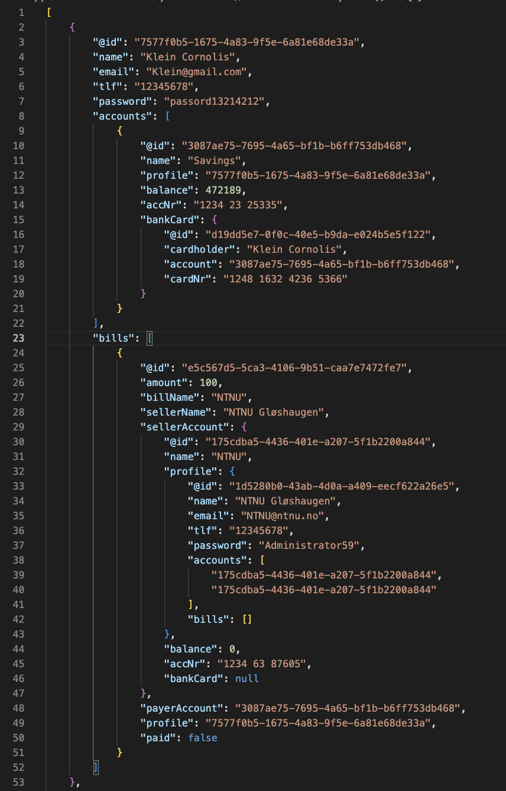
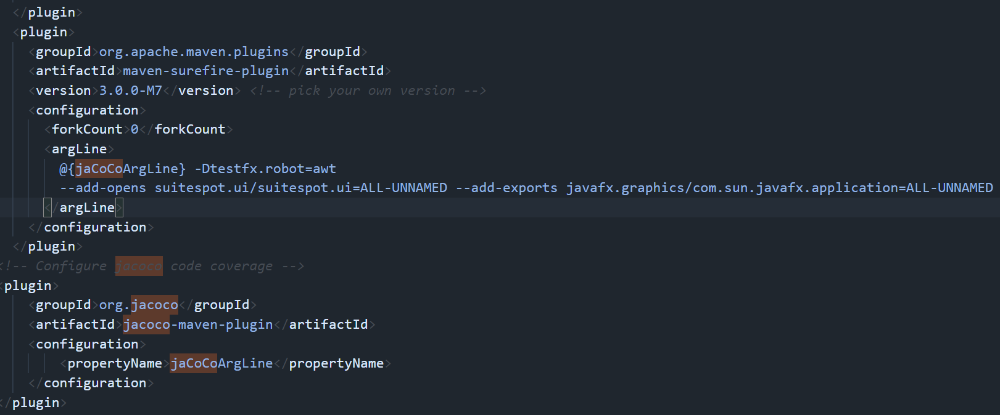
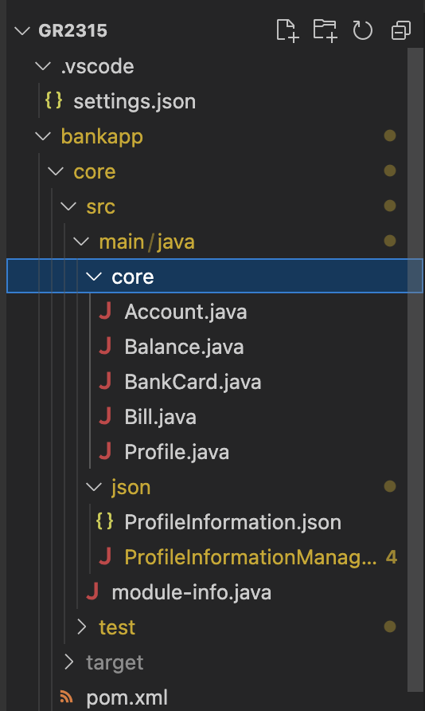
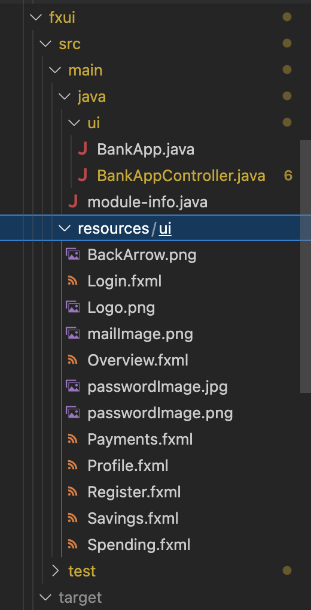
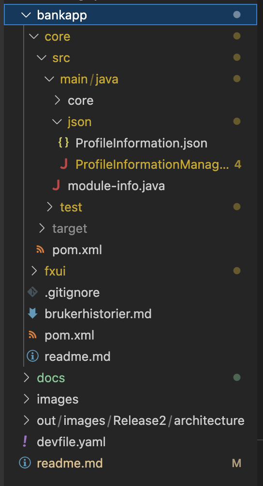

# Release 2
<em>Dette prosjektet krever Java version **16**, maven versjon **4.0.0**, maven compiler.source **16** og javafx version **17.0.2**. 

Eclipse-che link: https://che.stud.ntnu.no/#https://gitlab.stud.idi.ntnu.no/it1901/groups-2023/gr2315/gr2315?new

Merk: Det er mulig at eclipse-che krever at man har en gyldig personal access token.</em>

## Gruppesamarbeid og arbeidsvaner 
Gruppesamarbeidet fortsetter å fungere svært godt. Siden release 1 har gruppen endret litt på hvordan det arbeides, hovedsakelig ved å følge standarden der man jobber to og to sammen. Ved noen tilfeller har vi likevel jobbet hjemmefra, der man heller har valgt å jobbe for seg selv, fordi det rett og slett har vært enklere med tanke på timeplaner som kræsjer. Av samme grunn valgte vi heller ikke å gi hverandre faste sammarbeidspartnere, for å forhindre at man låste seg til å være avhengig av at denne personen var tilgjengelig. Dermed ble det bedre flyt i arbeidet.

Arbeidet ble fordelt ut ifra hvilke <em>issues</em> som måtte løses, og hva som trengtes å jobbes med med tanke på tidsfrister. De to som ønsket å jobbe sammen med en "issue" eller oppgave gikk sammen om det. Derfra ble det jobbet systematisk mot å fullføre oppgaver og holde tidsfrister som ble satt, samtidig som vi videreutviklet applikasjonen. 

En endring som ble gjort siden release 1 var å ha en <em>Development-branch</em> i git repository. Dette er greinen som skal inneholde den nyeste versjonen under arbeidet, altså der vi dytter endringer etter å ha gjort oss ferdig i en branch. <em>Master-branch</em> er de endelige versjonene ved hver release, og den versjonen som man er helt sikker på at fungerer og er riktig til enhver tid. Å jobbe med denne praksisen har fungert ganske godt, men det var et tilfelle der det ble dyttet til <em>Master-branch</em> og ikke <em>Development-branch</em> da vi nylig hadde gått over til denne praksisen. Utenom dette har denne standarden fungert godt og gjort arbeidet mer oversiktlig, i tillegg til å sikre at man alltid har en backup.

## Implementeringer ved release 2
### FXML

Ved release 2 har gruppen lagd alle grunnleggende FXML-filer, og lagt dem inn i prosjektet. Disse filene virker som en form for grunnmur for prosjektet, der funksjonaliteten gruppen ønsker å ha i applikasjonen blir realisert. Alle disse filene har blitt koblet opp med kontrolleren, slik at det er mulig å bevege seg mellom alle filene. Ettersom FXML-filene ble lagt inn, har nå flere FXML-tester blitt laget for å teste funksjonaliteten til applikasjonen.

Ved bruk av filhåndtering som utdypes mer under, har vi også fått på plass registrering av profil, og log-in funkjson. Dette gjør at vi kan lagre lagde profiler, og hente ut informasjon når man logger inn. I tillegg har gruppen begynt å implementere funksjonalitet i applikasjonen som tar bruk av informasjon om brukeren. Det er mulig å se saldo i brukskonto, total saldo, oversikt over kontoer og navnet til proifil vises i hver side. 

For gjøre det enklere å dokumentere FXML-testene, ble en ny JUnit versjon lagt til. Med denne versjonen kan vi legge til <em>@Displayname</em> i test-klassene. 

### Filhåndtering
Persistens med <em>JSON</em> er nå på plass. Gruppen valgte å bruke <em>Jackson</em>-biblioteket for å implementere denne logikken. <em>Jackson</em> gjør det mulig å skrive all informasjonen vi ønsker til en JSON-fil. <em>Jackson</em> sørger for å få dette på plass på en strukturert og oversiktlig måte, noe som også var en stor grunn til at gruppen bestemte seg for å benytte seg av akkurat dette biblioteket. 

Tester har også blitt skrevet for å teste funksjonaliteten til filbehandler klassen. Dette gjør at vi kan bli tryggere på at fil skriving og lesing ikke går feiler under fremtidig bruk i applikasjonen.

Gruppen bestemte seg for å benytte seg av implisitt lagring. Dette er fordi vi ønsker at applikasjonen skriver informasjonen om en ny bruker med en gang etter at en bruker blir opprettet. Altså, hvis man oppretter en ny bruker vil informasjon tilknyttet denne profilen sendes til fila. Dette har da blitt implementert i prosjektet.

Informasjonen som lagres:
- Profile: 
    - Navn
    - E-post 
    - Telefonnummer 
    - Passord 
    - Kontoer 
    - Regninger
- Account: 
    - Kontonavn 
    - Tilknyttet profil 
    - Saldo 
    - Kontonummer 
    - Bankkort 
- Bankkort: 
    - Kortholder 
    - Tilknyttet konto
    - Kortnummer
- Regninger: 
    - Beløp
    - Navn på regning 
    - Navn på den som skal betales til
    - Konto som skal betales til
        - Konto som skal betales til inneholder tilsvarende informasjon som punktene over
    - Konto som skal betale
    - Profil som eier konto som skal betale

Skjermdump av et eksempel på hvordan <em>JSON</em>-fila kan se ut:

Når det skrives til fil, lagrer <em>Jackson</em>-biblioteket informasjonen ut ifra hvilke <em>getter</em>-metoder man har i de ulike klassene. <em>Jackson</em>-biblioteket leser så fra fila og konstruerer objekter av typen til de ulike klassene ut ifra informasjonen lagret i fil. For å sørge for de ulike klassene finner riktig objekt, setter vi en id for noen av objektene. For eksempel har profile-klassen en id som skal sørge for at <em>Jackson</em> knytter kontoer, bankkort og regninger til riktig profil. Uten ID-ene vil relasjonen forsvinne. Tilsvarende logikk er brukt for de andre klassene, der dette var nødvendig.

De ulike klassene har ulike relasjoner med hverandre:
- Profile har en en-til-mange-relasjon med Account
- Profile har en en-til-mange-relasjon med Bill
- Bill har en en-til-to-relasjon med Account
- Account har en en-til-en-relasjon til BankCard

Ved release 1 hadde gruppen implementert filhåndtering slik gruppen hadde blitt lært i emnet objektorientert programmering. Dette var fordi gruppen misforstod hvordan filhåndteringen skulle implementeres, da kravet om å bruke <em>JSON</em> ikke var med i forrige arbeidskrav. Når arbeidskravet for release 2 derimot ble lagt ut, innså gruppen at filhåndteringen ble løst feil. Den gamle filhåndteringsklassen ble derfor tatt helt bort, og en ny klasse ble implementert, der <em>JSON</em> logikken nå er på plass. 

### Teknisk

En bug som ble med inn i release 1 var at <em>mvn javafx:run</em> og <em>mvn test</em> ikke ville kjøre på grunn av en feil i en av testene. Den kjørte likevel dersom man kommenterte ut testen. Dette er en bug som klarte å komme med ved forrige release. Dette har vi nå rettet opp i. 

Ser man videre på det tekniske har vi fått satt opp både <em>checkstyle</em> og <em>spotsbugs</em>. Vi brukte for det meste <em>spotsbugs</em> mellom release 1 of 2. Dette er fordi gruppen ikke rakk å sette seg ordentlig inn i checkstyle. Den ga ut over 250 error-meldinger, men mange av disse handlet om javadoc og at "det var for mange karakterer på en linje". Dette har vi sett bort fra for nå, men vil komme tilbake til ved neste release. 

Forbedringene spotsbug foreslo ble rettet på, men den foreslo også å innkapsle de ulike objektene ved å returnere kopier av hvert objekt. Dette er selvfølgelig god innkapsling, men dette førte til problemer med rekursjon, og problemer med <em>JSON</em>-fila. Slik koden vår er implementert nå, vil man havne i loop dersom dette forslaget rettes på. Derfor har vi valgt å ikke returnere kopier av alle objekter som opprettes. 

Videre har prosjektet blitt gjort eclipse che klart (se link øverst). 

### Jacoco problemer <em>(løst)</em>

Gruppen hadde problemer med Jacoco. Gruppen forsøkte å feilsøke og løse problemet, men klarte ikke dette. Gruppen fikk også hjelp av teknisk læringsasistent og spurte på piazza, men vi kom ikke fram til noen ordentlig løsning. En midlertidig løsning ble lagt inn i en egen branch, men vi dyttet ikke inn denne versjonen inn til <em>master-branch</em>, da det ikke var en ordentlig løsning. Denne løsningen innebærte at jacoco og <em>mvn test </em> ikke kan kjørte samtidig. De kjørte kun hver for seg, ved å manuelt gå inn i pom-filen og endre på <em>forkcount</em>. Skjermdumpen under viser et utklipp av pom-filen inne i denne egne branchen:

<em>branchname: testingBranch</em>

Gruppen var bevisste på denne feilen ved innleveringen, og skulle derfor rette opp i dette ved neste release. 
Dagen etterpå fikk gruppen derimot en mail fra en annen teknisks læringsassistent som hadde løst opp problemet vårt. Læringsassistanten la ved riktige <em>POM-filer</em>. På den andre siden ba han oss om å høre med noen andre om dette burde dyttes inn til master. Vi sendte derfor mail til undervisningsassistent, som ba oss om å dytte versjonen med kun jacoco-implementeringen inn. Vi fikk også lov til å endre på dokumentasjonen for å få dette med. Dette har gruppen altså gjort nå. Den versjonen som ligger inne på master nå har fungerende <em>jacoco</em> og <em>mvn test</em>.

### Mappestruktur 
Mappestrukturen har gått gjennom en stor endring. Ved release 1 hadde ikke prosjektet noen <em>module-info</em>. Dette er nå på plass, men som følge av dette ble mappestrukturen endret ganske mye. 

Ved release 2 ser mappestrukturen slik ut:

Arkitekturen er dermed følgende: 

Vi har gått for en arkitektur tilsvarende: 
- core
    - core
    - json
- ui

## Videre arbeid
### Teknisk
Siden vi begynte har vi jobbet i "egne" branch, der nye implementeringer gjøres inni disse. Deretter dyttes endringene til <em>development branch</em>, for så å begynne på nye implementeringer i den samme "egne" branchen. Det har likevel vært forskjell i gruppen på hvordan disse branches brukes. Noen lager en ny branch for hver issue eller oppgave, for å gjøre branches mer issue-spesifikke eller oppgavespesifikke. Dette er en praksis som er god og ha, og vi har nå blitt enige om at alle skal følge denne praksisen. Dette er en standard som ofte følges i det virkelige liv, og vi vil derfor også følge denne standarden. 

En annen ting gruppen skal sørge for at er helt på plass er å huske å ha med <em>Co-Author</em>. Det har vært tilfeller der man har glemt å ha det med på slutten av <em>commit</em>-meldinger, selv om man har jobbet sammen med en annen. Videre fant gruppen nylig ut av at man skulle skrive inn gitlab-brukernavnet til den man jobbet med, når <em>co-author</em> i <em>commit</em>-meldinger ble skrevet. Gruppen misforstod dette, og trodde at det holdt med kun navnet til personen. Fra nå av skal vi altså sørge for å skrive inn brukernavnet.

### Gitlab
Arbeidet vårt med gitlab har ikke vært helt konsist. Gruppen visste ikke ved release 1 at man skulle ha <em>milestones</em> ved hver release. Dette har blitt fikset på. Vi har valgt å ikke fortsette med andre <em>milestones</em> utover <em>releases</em> (altså <em>milestones</em> som kun heter <em>release[number]</em>). Tidligere kategoriserte vi ulike issues gjennom ulike <em>milestones</em>. Dette innså gruppen at ikke var særlig oversiktlig, og fort kunne se rotete ut på gitlab. Vi begynte derfor å ta i bruk <em>labels</em>, for å enklere kunne kategorisere de ulike <em>issues</em>. <em>Labels</em> er nemlig synligere på <em>issue-board</em>. <em>Issues</em> vil fra nå av kategoriseres med <em>labels</em> for å skille dem, og gå under <em>release-milestones</em>.

For å rydde opp ytterligere i gitlab lagde vi også en <em>milestone</em> for <em>release 1</em> og satt tilknyttede issues under denne. 

Gruppen skal også bli flinkere på å lage issues til det som blir jobbet med, slik at alt dette havner på gitlab. Vi har stort sett fulgt denne praksisen, men gruppen innrømmer å ha glemt dette ved noen anledninger. Vi skal også sørge for at alle <em>issues</em> får tildelt en oppdragstaker. Dette har gruppen glemt av og til. 

### Applikasjonen
Videre i utviklingen skal vi få på plass en oversikt over transaksjoner i applikasjonen. Dette skal gjøres ved å sikre persistens til fil med <em>JSON</em>, der JSON-fila inneholder oversikt over transaksjoner. Dette skal applikasjonen så lese, og så vise fram for brukeren. 

For hver endring av en brukers informasjon, for eksempel endring av passord eller at saldo endres, må applikasjonen oppdatere informasjonen inne i <em>JSON</em>-fila. Programmet må dermed hele tiden huske å oppdatere fila når en endring skjer. Denne logikken er ikke på plass enda, men skal være på plass ved neste release. 

Det skal også lages flere tester som tester både logikk og FXML mens applikasjonen videreutvikles og ny funksjonalitet settes inn. Vi skal også sette oss ordentlig inn i checkstyle, for å rette opp i det denne mener vi bør rette på, gitt at gruppen ser på dens error-meldinger som gyldige.

Det skal lages fxml-filer for å overføre penger, og betaling.

I applikasjonen skal det være mulig å bestille nytt kort, sperre kort og slette bruker. Dette skal vi vi få på plass ved neste release. 

Gruppen skal også rette opp i jacoco-problemet (se egen seksjon lenger oppe)