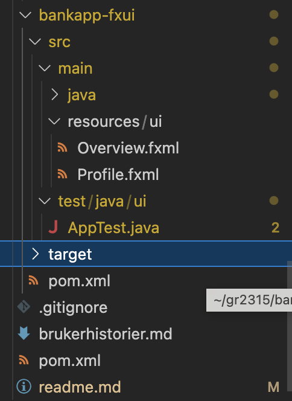

# Release 1

Dette prosjektet krever Java version 17.0.8 og maven versjon 3.9.4

## Gruppesamarbeid
Gruppen har stort sett jobbet sammen før første innlevering. Dette var stort sett for å unngå forvirringer i begynnelsen, og for å sørge for at alle kom i gang med prosjektet. Samarbeidet har funket veldig godt, og vi har kommet et godt stykke. 
Før release 1 har selve arbeidet foregått parallellt, hvor hvert medlem har jobbet i sin "egen" branch, og "pushet" de klargjorte versjonen til "master". Heretter har vi bestemt oss for å heller ha en "development branch" under master, som vi pusher inn til, med "egne branches" ut fra denne. "Master" vil være de versjonene som vi er helt sikre på at fungerer til en hver tid, og vi vil kun oppdatere denne når gruppen er helt tilfreddsstilt med versjonen i "development"

## Implementeringer ved release 1
Ved release 1 implementerte gruppen logikk for grunnklassene Account, Balance, BankCard og Profile. Balance-klassen,  BankCard-klassen og Account-klassen er ferdig implementert, mens de to andre ikke er det. Profile-klassen mangler implementasjon for å håndtere e-poster, samt en "get-metode" for å finne Account-objekter. Dette skal være klart innen neste innlevering. Gruppen har satt en "milestone" om å implementere ferdig grunnklassene innen 28.09.2023

Profile-klassen ser slik ut ved release 1: 
.png)
.png)
.png)
.png)

Vi har også laget en klasse som leser fra og skriver til fil. Det som skrives inn til filen er den personlige informasjonen knyttet til hver konto. Navn, e-post, telefonnummer og passord for brukeren lagres inni filen "PersonalInformation". Videre i prosjektet skal vi implementere logikk for å lagre kontoer og for å lagre fakturaer (sepapert)

Gruppen har laget to fxml-filer, "Profile" og "Overview". Disse er lagd i henhold til den mentale modellen gruppen hadde om prosjektet (se readme på rotnivå). Videre i prosjektet skal vi lage fxml-filer for de resterende knappene i appen (det man ser i menyen nederst) og implementere tilhørende logikk for disse filene.

Appen vår kjører med Maven, og vi har lagd tester som også kjører med Maven. Videre i prosjektet vil vi lage flere tester som tester mer av logikken til appen. Vi har satt opp Jacoco, og med dette verktøyet vil vi forsøke å få testet så mye som mulig av koden. 

Skjermbildene under viser den nåværende mappestrukturen i henholdsvis bankapp-core og bankapp-fxui i prosjektet (altså før release 1):

Utviklingen videre skal også få på plass logikk tilsvarende brukerhistoriene. 

