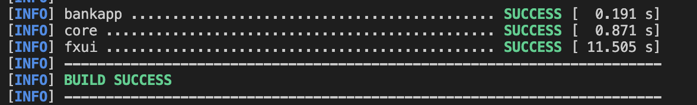

# Group gr2315 repository: Bankapp-prosjekt

<em>Dette prosjektet krever Java version **16**, maven versjon **4.0.0**, maven compiler.source **16** og javafx version **17.0.2**. 

Eclipse-che link: https://che.stud.ntnu.no/#https://gitlab.stud.idi.ntnu.no/it1901/groups-2023/gr2315/gr2315?new

Merk: 
- Det er mulig at eclipse-che krever at man har en gyldig personal access token

- (kjent problem med nyeste Mac programvare): Dersom du har en mac med MacOs Sonoma 14.0 kan det hende at applikasjonen kjører i bakgrunnen. Derfor er det viktig å gå ut av VSCode når man tester, slik at testene fungerer. 
</em>

Dette prosjektet er et utviklingsprosjekt tilsvarende det man skal gjennom i IT1901. 

Prosjektet bruker maven til bygging og kjøring. For å bygge, kjør `mvn install` fra rot-prosjektet (Bankapp -mappa). Dette vil kjøre alle tester og kvalitetssjekker. 
Prosjektet må kjøres fra **fxui**-modulen, enten med `mvn javafx:run -f fxui/pom.xml` eller ved å først kjøre `cd fxui` og så `mvn javafx:run`. Merk at man må først ha kjørt `mvn install` på modulene som **fxui**-modulen er avhengig av (pr. nå **bankapp**, **core** og **fxui**), for at det skal gå (se skjermdump nederst).

Applikasjonen vi har tenkt å lage er en bankapp. All form for fxui, fxml komponenter og kontrollere ligger inne i bankapp-fxui mappen. All informasjon og logikken som blir brukt av appen ligger i bankapp-core. 

